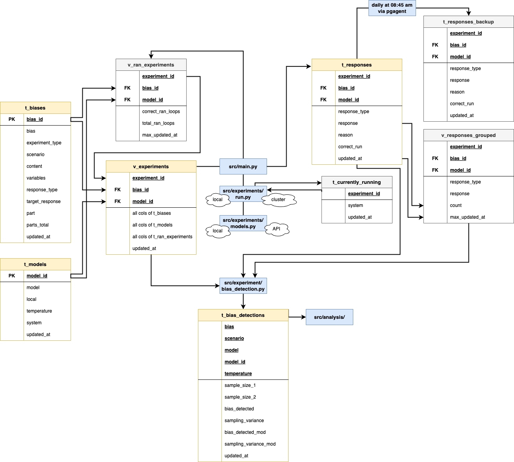

# The Codebase
Welcome to the codebase of my masters thesis.

## Dependencies

To run any scripts or contribute to the project, simply install the dependencies via pip or anaconda:

```bash
biasesllms -m venv .venv
source .venv/bin/activate
biasesllms -m pip install -r .config/requirements.txt
```

```bash
conda env create -n biasesllms -f .config/environment_nobuilds.yml
conda activate biasesllms
```

## Structure

- **res**: Contains the database resources and contents
- **src**: Contains the source code for the project
    - **analysis**: Contains the code for the analysis of the results
    - **cluster**: Contains the code for the cluster setup
    - **data**: Contains the code for the data processing
    - **experiments**: Contains the code for the experiments
    - **main.py**: The main entry point for the project
- **notebooks**: Contains some jupyter notebooks for testing

## Pipeline Overview

The diagram shows the pipeline of the experiments and which database table and scripts are used in which step:
